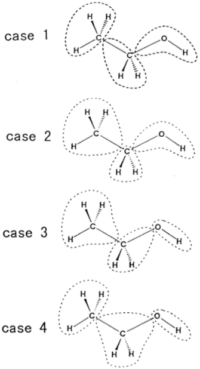

# Ethanol example from the Kitaura (1999) paper 

The paper tried looks at several different cases of bond partitionining and its effects on the FMO calculation outputs for the ethanol molecule. 


The following commands show how to use the code to generate the following cases. 


Case 1:  

```
python main.py  -s ethanol_conformer.sdf -o ethanol_case1 -bda 1 2 -baa 2 3 -fragstyle manual
```
Case 2:
```
python main.py  -s ethanol_conformer.sdf -o ethanol_case2 -bda 2 2 -baa 1 3 -fragstyle manual
```
Case 3:
```
python main.py  -s ethanol_conformer.sdf -o ethanol_case3 -bda 2 3 -baa 1 2 -fragstyle manual
```
Case 4:
```
python main.py  -s ethanol_conformer.sdf -o ethanol_case4 -bda 1 3 -baa 2 2 -fragstyle manual
```
