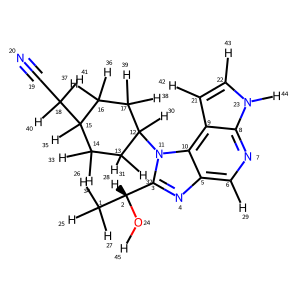
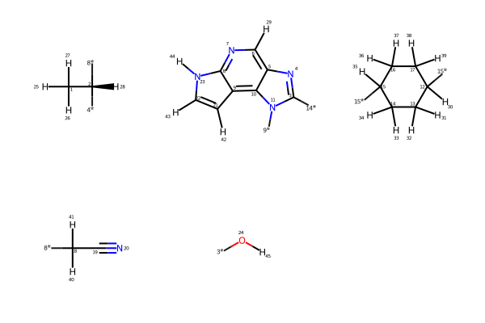

# FMO4smallmolecules
### FMO input file maker for small molecules
Usage when you only have smiles:
```
python main.py --smiles "C[C@H](c1nc2cnc3c(c2n1C4CCC(CC4)CC#N)cc[nH]3)O" --nconf 10 --basis "6-31G**" --scftyp rhf --outprefix 1J6
```
Usage when you only have an SDF file and want to try manual fragmentation you need to provide a list of bond attached and bond detached atoms:
```
python main.py -sdf conformer.sdf -bda 11 -baa 10 -fragstyle manual -o test_compound
```
Usage when you only want to draw the molecule with sp3 carbons and atoms highlighted
```
python main.py -sdf conformer.sdf -showmol True
```

if the -showmol True argument is passed, regardless of any other arguments being passed, the code will draw the molecule and stop.

The output consists of:
1. GAMESS .inp files for each conformer, 
2. .png file showing the atom numbering, 
3. .svg file showing the different fragments generated using BRICS for now, 
4. .sdf file with conformers generated,
5. conf_energies.txt with the energies of each generated conformer using the MMFF94s forcefield.

This is the molecule in the usage example above, 

and the fragments that were generated,


This code is under heavy development and should not be used for production calculations. The concerns right now are,
1. The fragmenting is automated but uses BRICS rules which I am not focusing on right now,
2. The biggest issue is the Hybrid Orbital Projection operators being used in the FMOHYB section of the input files as these were generated for only sp3 hybridized C-C bonds and not for a general X-X bond with any type of hybridization. This is the main bug being worked upon but I am not sure if this would be public.  
